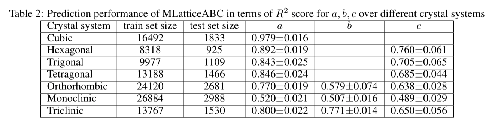

# MLatticeABC


## Premise

MLatticeABC is a random forest machine learning model with a new feature set combined with the standard composition features such as Magpie descriptors for effective lattice constant (edge length) prediction. 

## Performance on Materials Project dataset



## Environment Setup

To use `MLatticeABC` you need to create an environment with the correct dependencies. Using `Anaconda` this can be accomplished with the follow commands:

```bash
conda create --name mlatticeabc python=3.6
conda activate mlatticeabc
conda install --channel conda-forge pymatgen
pip install matminer
pip install scikit-learn==0.23.1
```

## MLatticeABC Setup

Once you have setup an environment with the correct dependencies you can install `mlatticeabc` using the following commands:

```bash
conda activate mlatticeabc
git clone https://github.com/Yuxinya/liyuxin
cd liyuxin
pip install -e .
```

Pre-trained models are stored in google drive. Download the file `model.zip` from from the [drive](https://drive.google.com/file/d/1rIdu_ZvhQ5iGQkrSY5Uh3yLH_L1uel4U/view?usp=sharing). After downing the file copy it to `liyuxin` and extract it. the folder of `Model` should be in the `liyuxin` directory after the extraction is completed.
## Example Use

In order to test your installation you can do so by running the following example from the top of your `mlatticeabc` directory:

```sh
cd /path/to/liyuxin/
python predict.py -i formula -s crystal_system
such as:
python predict.py -i Mn16Zn24Ge24O96 -s cubic
python predict.py -i Mn16Zn24Ge24O96
```
